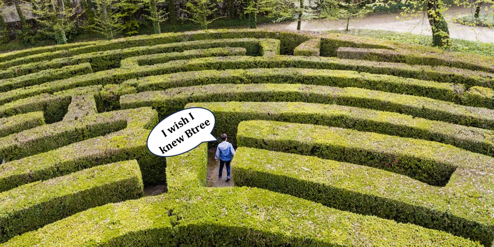

# B-Tree Maze Solver in C++ using Dijkstra's algorithm


This C++ project implements a B-Tree data structure to solve maze problems. The code includes classes for B-Tree nodes, a matrix node, a heap node, a heap, and the B-Tree itself. The primary objective is to find the shortest path through a maze from a starting point to an endpoint using Dijkstra's algorithm.

## Project Structure

### Btree_node

The `Btree_node` class defines the structure of a B-Tree node. Each node can hold up to three integer values (`data1`, `data2`, and `data3`) and has four pointers (`left`, `mid`, `right`, and `extra`) to other nodes. These nodes are used to construct the B-Tree.

### matrix_node

The `matrix_node` class represents a node in the maze matrix. It includes an integer `weight` that represents the weight of the path to this node and `min_weight`, which stores the minimum weight from the start point to this node. The `father` pointer helps reconstruct the shortest path.

### heap_node

The `heap_node` class is used in the heap data structure. It holds two values, `id` representing a matrix node's unique identifier and `min_weight_mat`, which stores the minimum weight for a node in the heap.

### heap

The `heap` class is an implementation of a min-heap data structure. It contains functions for inserting, deleting, updating, and comparing nodes within the heap.

### b_tree

The `b_tree` class represents the B-Tree structure used for storing visited nodes in the maze. It includes functions for inserting, splitting nodes, performing Dijkstra's algorithm, and finding a place for insertion in the tree.

## How to Use

1. Create a maze matrix by inputting the number of rows (`n`) and columns (`m`) followed by the maze layout.

2. Instantiate the `b_tree` object and a `heap` object.

3. Run the Dijkstra's algorithm to find the shortest path through the maze.

4. Print the resulting matrix with the shortest path highlighted.

## Example Usage

```cpp
int main()
{
    int n, m, x, y1, y2;
    cin >> n >> m;
    matrix_node **matrix = new matrix_node *[n];

    // Initialize the maze matrix and set values.

    b_tree tree;
    heap min_heap(n * m);
    tree.dijkstra(matrix, 0, y1, y2, n, m, tree, min_heap);
}
```

# TestCase
## input
```
8 10
0 0 0 1 0 0 0 0 0 0
0 1 1 1 0 1 1 0 1 0
0 1 0 1 0 0 1 1 1 0
0 0 0 1 1 1 1 0 0 0
0 1 1 1 0 0 1 1 1 0
0 1 0 0 0 1 1 0 0 0
0 1 0 1 1 0 1 1 1 0
0 0 0 0 0 0 0 1 0 0
```

## output
```
0 0 0 -1  0  0  0  0 0 0
0 1 1 -1  0  1  1  0 1 0
0 1 0 -1  0  0  1  1 1 0
0 0 0 -1 -1 -1 -1  0 0 0
0 1 1  1  0  0 -1  1 1 0
0 1 0  0  0  1 -1  0 0 0
0 1 0  1  1  0 -1 -1 1 0
0 0 0  0  0  0  0 -1 0 0
```
